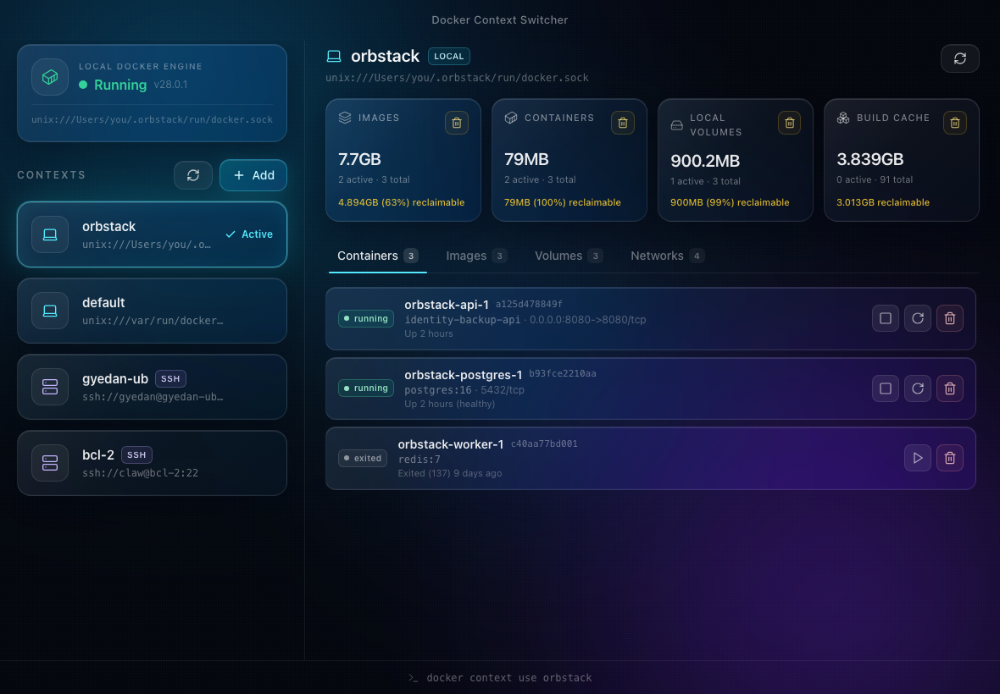

# Docker Context Switcher

[](./LICENSE)
[](#getting-started)
[](https://tauri.app)
[](https://github.com/danielinspring/docker-context-switcher/actions/workflows/ci.yml)

A liquid-glass desktop app for switching Docker contexts between local engines
and remote SSH endpoints — and managing each context's containers, images,
volumes, networks, and disk usage from one window.

Built with Tauri, React, TypeScript, Tailwind CSS, and Framer Motion.



## Features

- **Local engine status** — live indicator for the local Docker engine:
  🟢 running / 🟡 stopped / 🔴 not installed.
- **Context discovery** — lists every Docker context on the machine and
  highlights the active one.
- **One-click switching** — selecting a context runs `docker context use
  <name>`, so the change persists for every terminal session.
- **Remote SSH registration** — a form that creates `ssh://user@host:port`
  contexts for NAS boxes, lab servers, etc.
- **Resource console** — for the active context (local *or* remote SSH):
  - **Containers** with live state, plus start / stop / restart / remove.
  - **Images**, **Volumes**, and **Networks** with in-use vs. unused flags.
  - **Disk usage** per category (`docker system df`) showing size and exactly
    what is reclaimable, with a one-click **prune** for each — plus per-item
    removal, all gated by a confirmation that shows the exact command first.
- **Menu-bar utility** — a template tray icon lives in the macOS menu bar.
  Closing the window minimizes the app to the menu bar (and drops the dock
  icon) instead of quitting; left-click the icon to toggle the window,
  right-click for Show / Hide / Quit.
- **Liquid Glass UI** — real macOS window vibrancy (Tauri `windowEffects`)
  under frosted glass panels, drifting aurora gradients, and spring-physics
  transitions.

## Getting Started

### Prerequisites

- **Node.js** 20 or newer
- **Rust** (stable) — install via [rustup](https://rustup.rs)
- **Xcode Command Line Tools** — `xcode-select --install`
- A working **Docker CLI** (Docker Desktop, OrbStack, Colima, …)

### Develop

```bash
npm install

# Full desktop app (macOS vibrancy, Rust backend, tray icon)
npm run tauri dev

# UI-only preview in a browser (in-memory mock backend, no Rust/Docker needed)
npm run dev
```

Outside the Tauri shell every backend call falls back to an in-memory mock, so
`npm run dev` stays fully interactive for UI work without a daemon.

### Build

```bash
npm run tauri build   # produces a .app and .dmg under src-tauri/target
```

## Architecture

```
src/                      React + TypeScript frontend
├── components/           Presentational components (glass design system)
├── hooks/                useDocker (contexts + engine), useResources (per-context)
├── lib/backend.ts        Typed IPC boundary — falls back to lib/mock.ts
│                         when running outside the Tauri shell
└── styles/global.css     Liquid Glass tokens (Tailwind v4 @theme)

src-tauri/                Rust backend (Tauri v2)
├── src/commands.rs       IPC commands — thin wrappers over docker.rs
├── src/docker.rs         Typed Docker operations (parse CLI JSON, mutations)
├── src/platform.rs       OS seams + the run_docker primitive (timeout, PATH)
├── src/tray.rs           Menu-bar item + minimize-to-tray
└── tauri.conf.json       Transparent window + native vibrancy config
```

### Design decisions

- **Context discovery uses `docker context ls --format json`,** not
  `~/.docker/config.json`. The config file only stores `currentContext`;
  context definitions live under `~/.docker/contexts/meta/…`, so the CLI is the
  only stable, documented interface.
- **Resource queries are scoped with `docker --context <name>`,** so the
  console reflects the context you're inspecting without relying on ambient
  global state.
- **Engine status is probed against the active local context's endpoint**
  (e.g. OrbStack / Docker Desktop sockets), not a hardcoded
  `/var/run/docker.sock`.
- **All process execution uses argument vectors, never shell strings,** so
  user-supplied names / hosts / ids can't inject commands. Every `docker`
  invocation is bounded by a timeout so an unreachable SSH context can't hang
  the window.
- **Everything OS-specific lives in `src-tauri/src/platform.rs`** — Windows
  (named pipes, `docker.exe`) and Linux support extend that module only.

## Roadmap

- [x] Repository scaffold, Liquid Glass UI, window config
- [x] Rust backend: context ls/use/create, engine ping
- [x] Resource console (containers/images/volumes/networks), disk usage +
      prune, confirm gating
- [x] Menu-bar item with minimize-to-tray + window toggle
- [ ] Quick context switching from the tray menu
- [ ] Per-context health polling
- [ ] Windows / Linux builds

## Contributing

Contributions are welcome — see [CONTRIBUTING.md](./CONTRIBUTING.md) for the dev
setup, coding conventions, and PR checklist. By participating you agree to the
[Code of Conduct](./CODE_OF_CONDUCT.md). To report a security issue, see
[SECURITY.md](./SECURITY.md).

## License

[MIT](./LICENSE) © danielinspring and contributors
